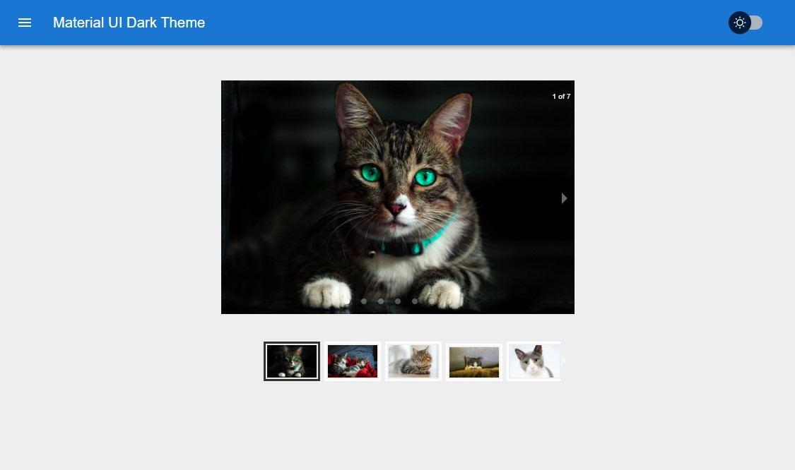
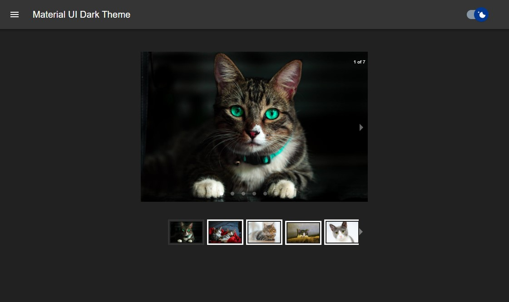

# Creating Dark theme using React hooks and context in Material UI

## Install

```
npx create-react-app mui-dark-theme-app
cd mui-dark-theme-app
npm start
```

## Add Some Hooks

```
npm install @mui/material @emotion/react @emotion/styled
npm install @mui/base
npm install @material-ui/icons
npm install react-responsive-carousel
```

---

## Used Technologies

- React
- Material UI
- Context Api

---

## [Codesandbox](https://codesandbox.io/s/creating-dark-theme-using-react-hooks-and-context-in-material-ui-j8gitj?file=/src/App.js)

---



